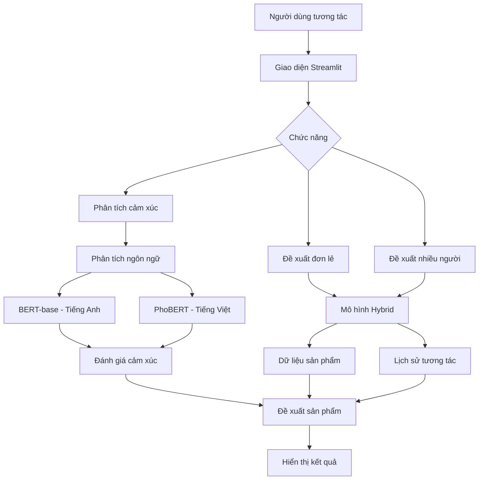

# 🛍️ Hệ Thống Đề Xuất Sản Phẩm Thương Mại Điện Tử

## 🚀 Giới thiệu

Hệ thống đề xuất sản phẩm thông minh kết hợp nhiều phương pháp để đưa ra gợi ý chính xác cho người dùng. Hệ thống tích hợp:

- **Đề xuất theo người dùng đơn lẻ**: Phân tích hành vi và sở thích cá nhân
- **Đề xuất cho nhiều người dùng**: Xử lý hàng loạt cho nhiều người dùng cùng lúc
- **Phân tích cảm xúc**: Đánh giá đánh giá của người dùng để hiểu rõ hơn về sản phẩm

## 📑 Mục lục
- [🚀 Giới thiệu](#-giới-thiệu)
- [🏗️ Kiến trúc hệ thống](#️-kiến-trúc-hệ-thống)
- [✨ Tính năng chính](#-tính-năng-chính)
- [🛠️ Công nghệ sử dụng](#️-công-nghệ-sử-dụng)
- [📦 Cài đặt](#-cài-đặt)
- [🤖 Tải mô hình phân tích cảm xúc](#-tải-mô-hình-phân-tích-cảm-xúc)
- [📊 Cấu trúc thư mục](#-cấu-trúc-thư-mục)
- [🚀 Cách sử dụng](#-cách-sử-dụng)
- [🤝 Đóng góp](#-đóng-góp)
- [📬 Liên hệ](#-liên-hệ)

## 🏗️ Kiến trúc hệ thống



## ✨ Tính năng chính

### 1. Hệ thống đề xuất Hybrid
- Kết hợp Content-based và Collaborative Filtering
- Tích hợp thông tin người dùng và sản phẩm
- Đề xuất theo ngữ cảnh và hành vi

### 2. Phân tích cảm xúc
- **Hỗ trợ đa ngôn ngữ**:
  - Tiếng Anh: Sử dụng mô hình BERT-base cho phân tích cảm xúc chính xác
  - Tiếng Việt: Tận dụng PhoBERT - mô hình ngôn ngữ tiên tiến dành riêng cho tiếng Việt
- **Phân tích đánh giá theo thời gian thực** với độ chính xác cao
- **Tự động phát hiện ngôn ngữ** và áp dụng mô hình phù hợp
- Giao diện trực quan, dễ sử dụng cho người dùng cuối

### 3. Xử lý dữ liệu
- Nhập liệu đa dạng (file CSV, nhập trực tiếp)
- Xử lý dữ liệu quy mô lớn
- Tự động phát hiện ngôn ngữ

## 🛠️ Công nghệ sử dụng

- **Ngôn ngữ lập trình**: Python 3.8+
- **Thư viện chính**:
  - `scikit-learn`: Xây dựng và đánh giá mô hình
  - `surprise`: Thuật toán đề xuất
  - `transformers`: Hỗ trợ BERT-base và PhoBERT
  - `torch`: Nền tảng học sâu
  - `streamlit`: Giao diện người dùng
  - `phobert`: Xử lý ngôn ngữ tiếng Việt
  - `sentence-transformers`: Xử lý biểu diễn văn bản
  - `huggingface-hub`: Tải mô hình từ Hugging Face

## 📦 Cài đặt

1. **Clone repository**:
   ```bash
   git clone https://github.com/yourusername/e_commerce_hybrid_recommendation.git
   cd e_commerce_hybrid_recommendation
   ```

2. **Tạo môi trường ảo** (khuyến nghị):
   ```bash
   python -m venv venv
   source venv/bin/activate  # Trên Windows: venv\Scripts\activate
   ```

3. **Cài đặt thư viện**:
   ```bash
   pip install -r requirements.txt
   ```

## 🤖 Tải mô hình phân tích cảm xúc

Hệ thống sử dụng hai mô hình phân tích cảm xúc được lưu trữ trên Hugging Face:

1. **Mô hình tiếng Anh** (BERT-base):
   ```bash
   python -c "from huggingface_hub import snapshot_download; snapshot_download(repo_id='Anhkiet098/2-States-of-Sentiment-Analysis-in-English', local_dir='models/english_sentiment')"
   ```

2. **Mô hình tiếng Việt** (PhoBERT):
   ```bash
   python -c "from huggingface_hub import snapshot_download; snapshot_download(repo_id='Anhkiet098/2-States-of-Sentiment-Analysis-in-Vietnamese', local_dir='models/vietnamese_sentiment')"
   ```

Sau khi tải xong, cấu trúc thư mục `models` sẽ như sau:
```
models/
├── english_sentiment/
│   └── ... (các file mô hình tiếng Anh)
├── vietnamese_sentiment/
│   └── ... (các file mô hình tiếng Việt)
└── ... (các mô hình khác)
```

4. **Chạy ứng dụng**:
   ```bash
   streamlit run app.py
   ```

## 📊 Cấu trúc thư mục

```
e_commerce_hybrid_recommendation/
├── app.py                # Ứng dụng chính
├── components/           # Các thành phần giao diện
│   ├── __init__.py
│   ├── multi_user.py     # Xử lý nhiều người dùng
│   ├── sentiment_analysis.py  # Phân tích cảm xúc
│   └── single_user.py    # Xử lý người dùng đơn lẻ
├── data/                 # Dữ liệu mẫu
├── models/               # Mô hình đã huấn luyện
│   ├── english_sentiment/  # Mô hình phân tích cảm xúc tiếng Anh
│   ├── vietnamese_sentiment/  # Mô hình phân tích cảm xúc tiếng Việt
│   ├── recommender.py    # Lớp đề xuất sản phẩm
│   └── sentiment_analyzer.py  # Phân tích cảm xúc
├── requirements.txt      # Thư viện phụ thuộc
└── settings.py           # Cấu hình ứng dụng
```

## 🚀 Cách sử dụng

1. **Đề xuất đơn lẻ**:
   - Chọn sản phẩm hoặc nhập ID người dùng
   - Xem danh sách sản phẩm được đề xuất

2. **Đề xuất nhiều người dùng**:
   - Tải lên file CSV chứa dữ liệu người dùng
   - Hệ thống xử lý và trả về kết quả

3. **Phân tích cảm xúc**:
   - Nhập văn bản đánh giá
   - Hệ thống tự động phát hiện ngôn ngữ
   - Xem kết quả phân tích cảm xúc

## 🤝 Đóng góp

Mọi đóng góp đều được chào đón! Vui lòng tạo Pull Request hoặc mở Issue để thảo luận.
 
## 📬 Liên hệ

- Email: chauanhkiet2906@gmail.com
- LinkedIn: https://www.linkedin.com/in/chauanhkiet2906/
